### Neural Networks - CNN in PyTorch
##### Author: Li-Hsin Tseng
Source code: img2num.py, img2obj.py

Part A

training time comparison between nn and cnn

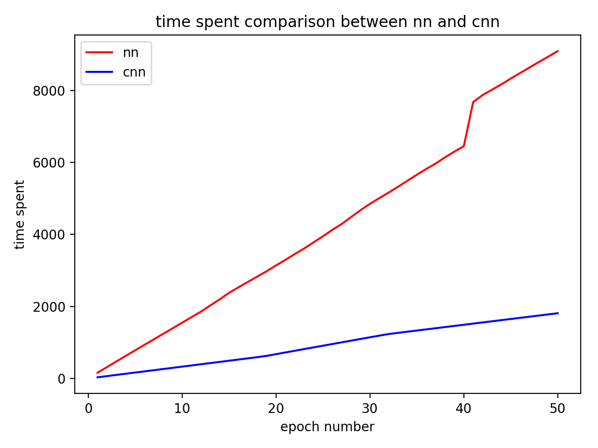

error rate between nn and cnn

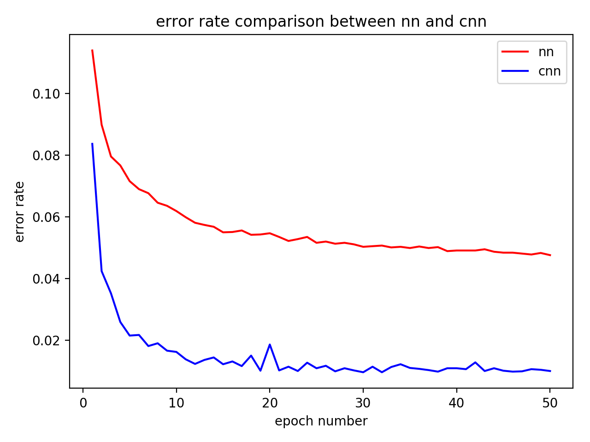

forward time comparison between nn and cnn

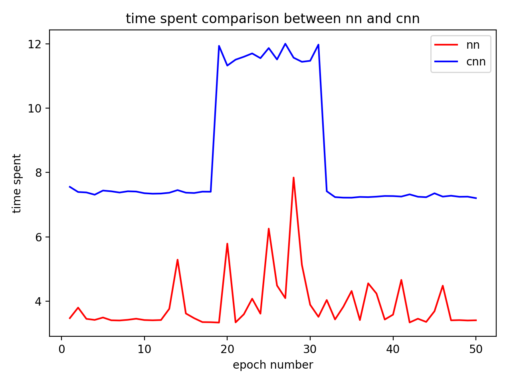

Part B

model training and forwarding time

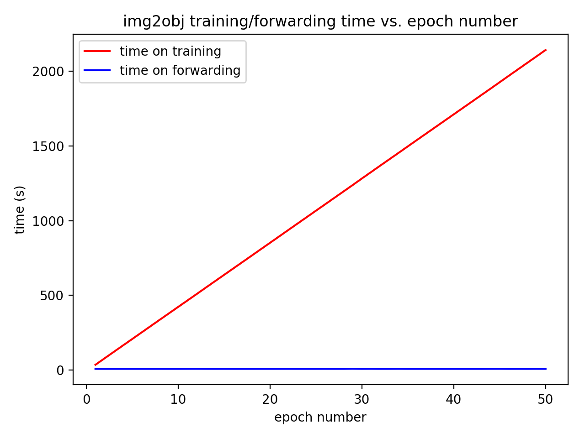

error rate v.s. epoch number

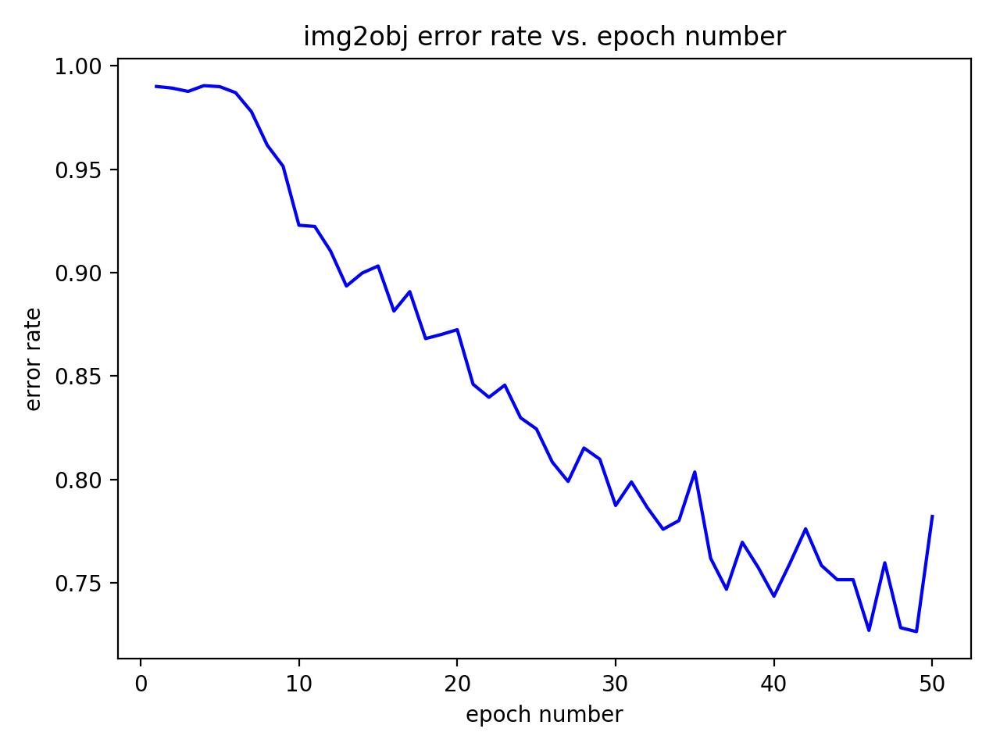

view function

correct labeling

|        view_4.png       |        view_6.png        |
|:-----------------------:| ------------------------:|
| 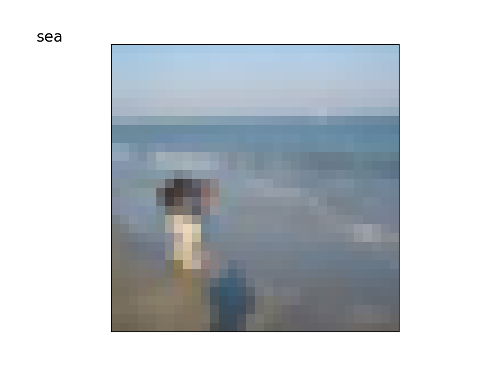 |  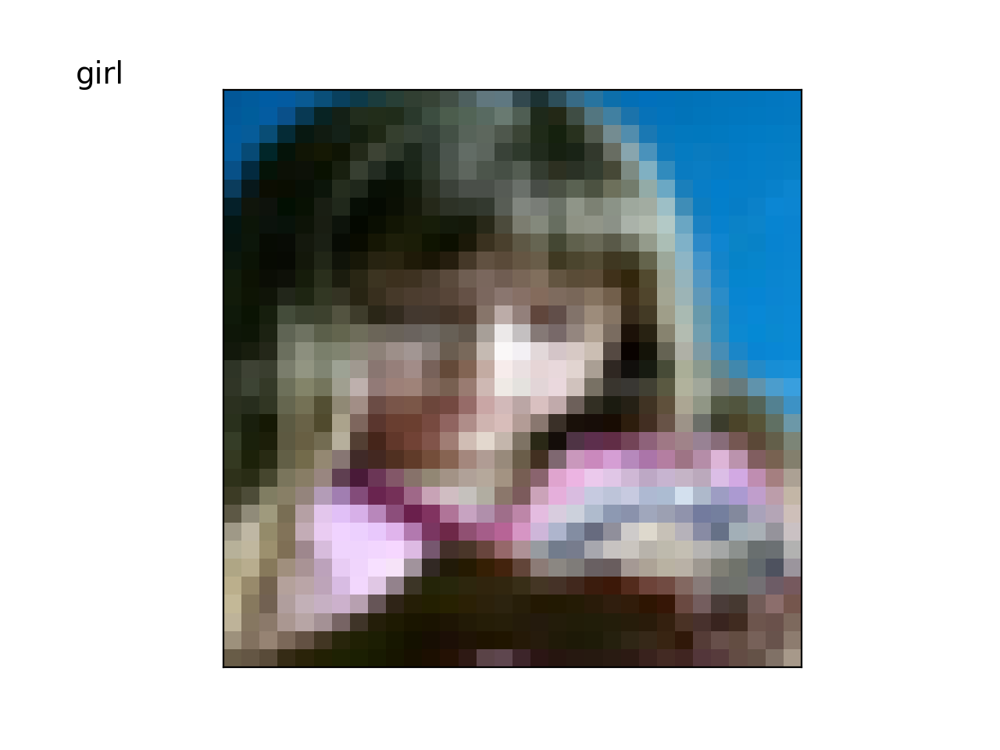 |

incorrect labeling

|        view_1.png       |        view_2.png        |        view_3.png        |
|:-----------------------:| ------------------------:| ------------------------:|
| 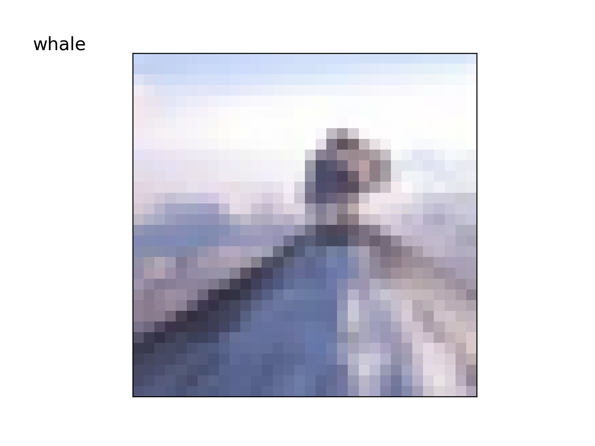 |  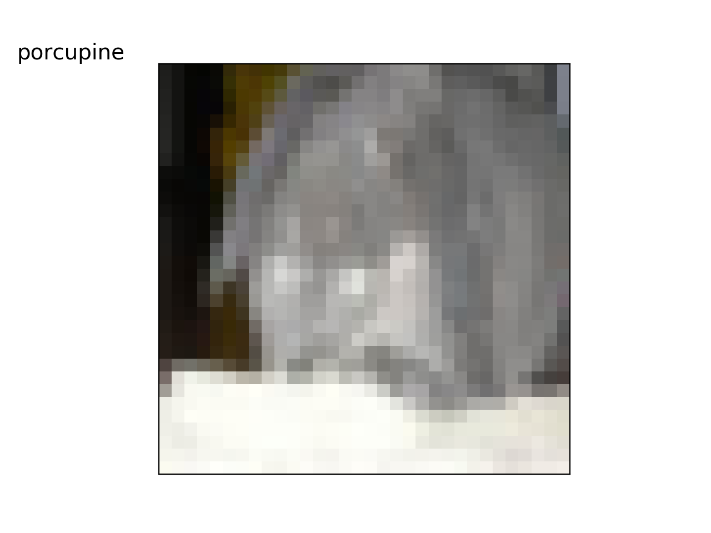 |  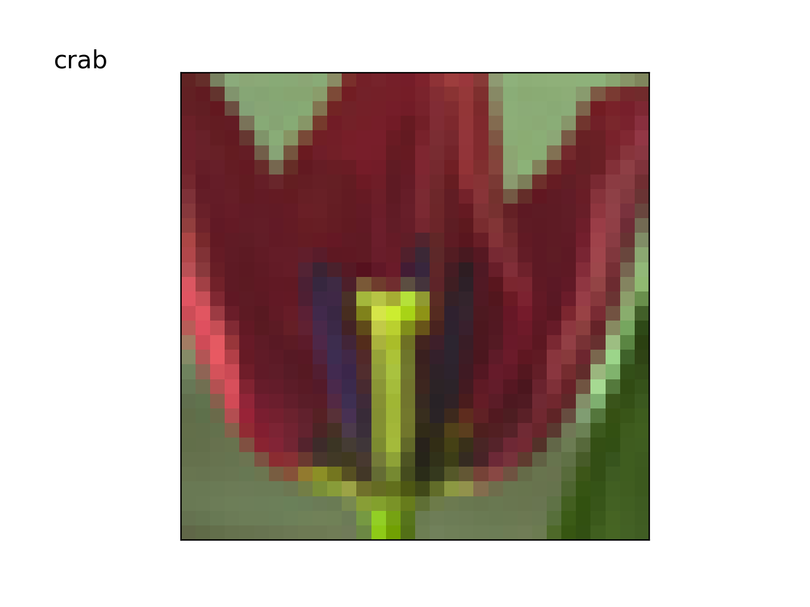 |

|        view_5.png       |        view_7.png        |        view_8.png        |
|:-----------------------:| ------------------------:| ------------------------:|
| 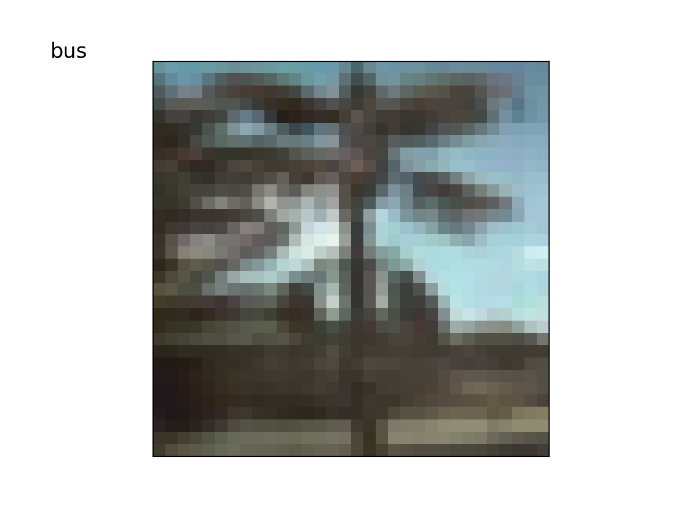 |  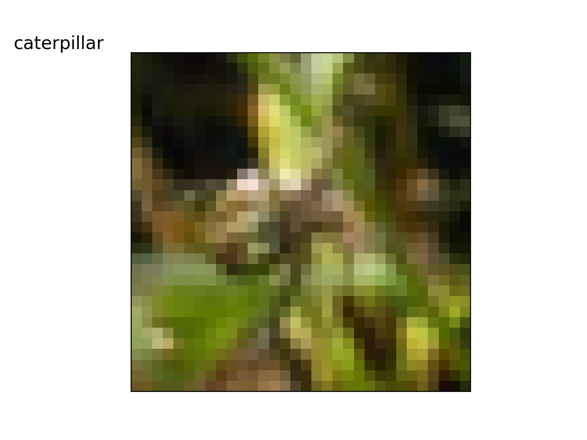 |  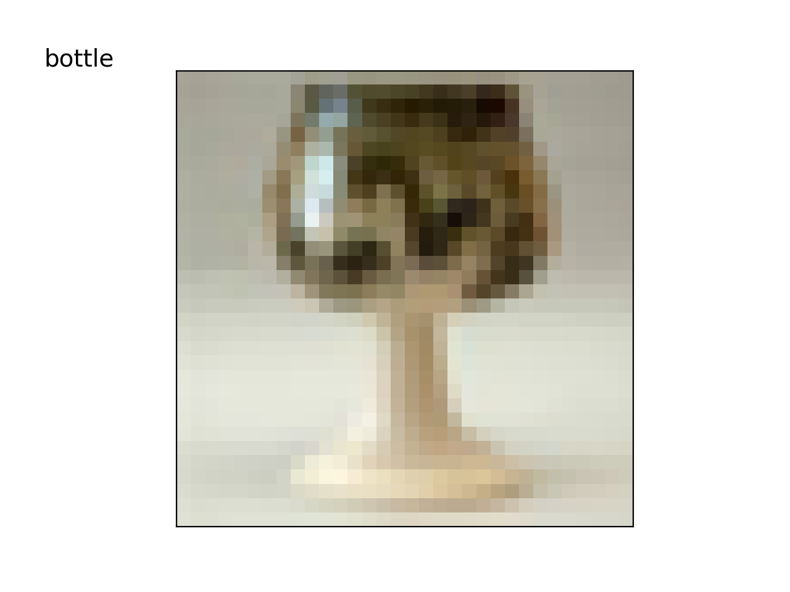 |

cam function

|        cam_1.png       |        cam_2.png        |
|:----------------------:| -----------------------:|
|  |  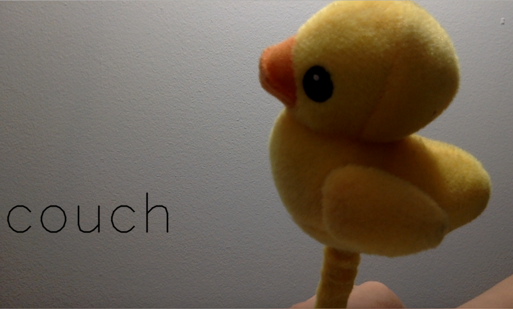 |

